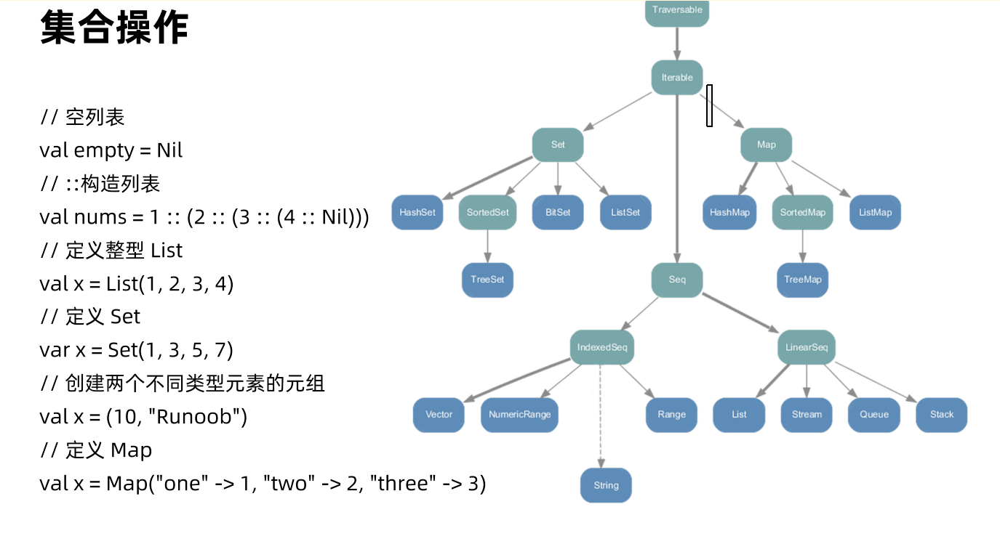

## val和var

* scala可以通过val和var声明变量
* val也可以叫常量，相当于java的final关键字
* val定义的变量不能改变其引用的对象本省，但是可以改变其引用的对象的其他属性
* 尽可能的使用val
* 类型不需要指定，可自行推断

```scala
var v1 = ''code'' // 自动推导类型
var v2: Int = 2 // 显示指定类型
v2 = 4 // 可以改变值

val v3 = 1 // 相当于final修饰
val v4: Double = 3.14
val v5 = Array(1, 2, 3)
v5(1) = 10  // 可以改变对象的其他属性，但是不能直接改变对象本身
```

## 类

* scala所有的值都是类，继承一个统一的根类型Any.
* Null是所有引用类型的子类型，null是Null的唯一实例
* nothing是所有类型的子类型，Nothing没有实例，但是可以用来定义类型。
* Unit类型可以标识过程，没有返回值的函数，类似于Java的void，Unit只有一个实例: ().

## 循环

* while循环
* for循环
  * for不支持continue和break
  * for (i <- 表达式)
  * for (i <- 1 to 3) 和for (i <- 1 until 3) 和 for(i <- (1 until 3).reverse)
* 循环守卫
  * for(i <- 1 to 10 if i % 3 =0)
* 循环变量
  * for(i <- 1 to 3;j=4-i)
* 嵌套循环
  * for(i <- 1 to 3;j <- 1 to 3)
* 循环返回值
  * val x = for(i <- 1 to 10) yield i

## 集合



## case class

case class Person (age: Int, name: String)

* 伴生对象
编译Person.scala会产生两个class, Person.class和Person$.class 编译器自动添加了一个伴生
对象object Person
* apply()方法
伴生对象Person里面默认实现了创建对象的apply()方法，创建实例的时候不需要使用关键字
new，可以直接通过Person(age, name)得到一个实例对象
* 字段默认加上了val
age和name都被定义成了val（final） • toString()、hashCode()和equals()
使用age和name构建
* 实现Serializable接口

## trait

* 相当于Java中的接口，但可以定义抽象方法，也可以定义字段和方法的实现。
* 在没有自己实现的方法体时，可以认为它和Java的interface是等价的。
* 可以使用extends或with关键字把trait混入类中。

## option

* 目的是为了避免使用null，在Java里，null是一个关键字，不是一个对象，所以对它调用任何方法都是非法的。
* Option类型用来表示一个值是可选的（有值或无值)。 • Option[T]是一个类型为T的可选值的容器：如果值存在，Option[T]就是一个Some[T] ，如果不存在， Option[T]就是对象None。
* Option常用方法:
  * def isEmpty: Boolean 检测可选类型值是否为None，是的话返回true，否则返回false。 
  * def isDefined: Boolean 等价于!isEmpty。
  * def getOrElse(default: => B): B 如果选项包含有值，返回选项值，否则返回设定的默认值。
* def orElse(alternative: => Option[B]): Option[B] 如果选项包含有值返回选项，否则返回alternative。 
* def orNull 如果选项包含有值返回选项值，否则返回null。
* 模式匹配

```scala
val nameMayBe: Option[String] = "test"
nameMayBe match {
  case Some(name)=>
    println(name.trim.toUppercase)
  case None =>
    println("no name val")
}

v match {
  case x: Int => println("Int " + x)
  case y: Double if(y>=0) => println("Double " + y)
  case z: String => println("String "+z)
  case _ => throw new Exception("not match exception")
}

try {
  var r 10 / 0
} catch {
  case ex: ArithmeticException => println("捕获了除数为零的算数异常")
  case ex: Exception => println("捕获了异常")
}
```

