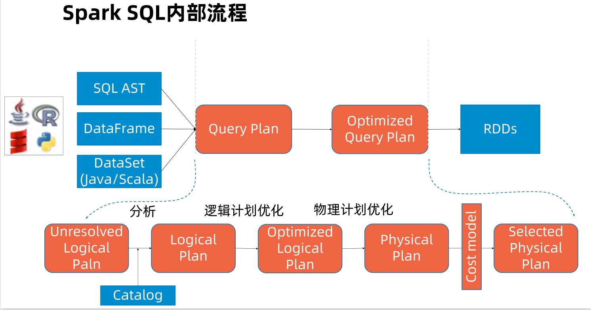
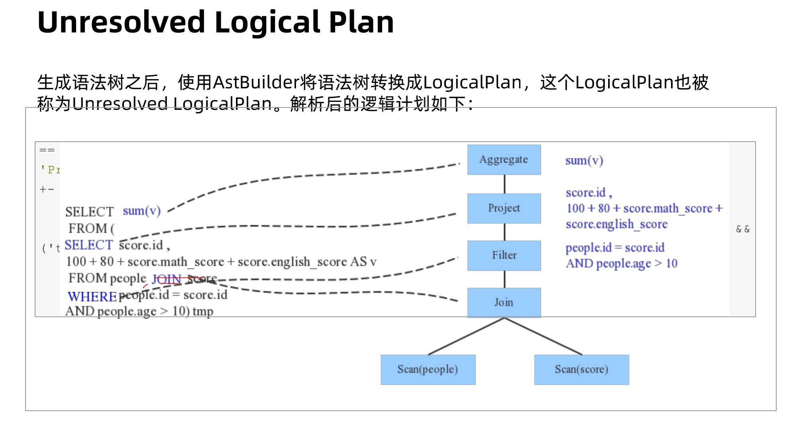
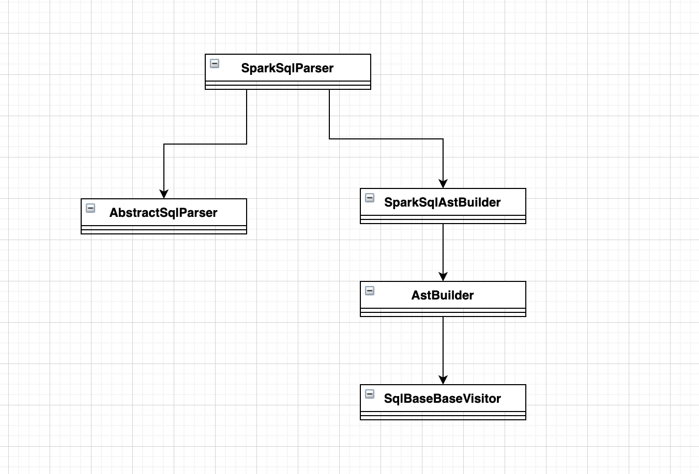

## 流程图



一些概念:

* dataframe & dataset 结构化数据的高度抽象接口，可以重复利用优化器
* structure streaming 流式处理, 专门处理实时类应用
* catalyst 查询优化器，代码自动生成
* tungsten 专门为spark应用进行内存CPU的优化
* mlib 机器学习库
* graphx 图形计算库

### sql与dataframe接口

用sql计算或查询

```sql
select name, avg(age) from prople group by name
```

用dataFrames计算或查询

```java
sqlCtx.table("people").groupBy("name").agg("name", avg("age")).collect()

```

### rdd、dataFrame、dataSet的对比区别

[参考链接](https://andr-robot.github.io/RDD-DataFrame%E5%92%8CDataSet%E5%8C%BA%E5%88%AB)

### 生成unresolved logical plan



主要源码:  _SparkSqlAstBuilder_ 、 _AstBuilder_
使用visit模式遍历token ast tree，生成unresolved logic plan



**如上所示:**

_SparkSqlAstBuilder继承自AstBuilder，AstBuilder继承自antlr自动生成的SqlBaseBaseVisitor(SqlBase.g4)，即antlr的访问者模式，然后按照用户的定制把抽象语法树转换成了Logical Plan。_

### 大致流程

首先是把sql解析成为抽象语法树，如下:


然后parsePlan 函数的中匿名函数再把语法树转换成LogicalPlan类型的语法树。比如where转成成Filter类，select转换成Project类，group by转成Aggregate等等.

AbstractSqlParser中的parse负责把sql语句解析成抽象语法树，这棵语法树中包含了标点符号等等最全的信息，相当于检查了一遍语法规则，里面包含了太多的无用信息；parsePlan中的匿名函数再根据spark sql的语法，把每个节点转成对应sparkAPI的类型为TreeNode的逻辑计划树。


### 代码分析

1、先来看类**AbstractSqlParser**的下面方法，这里解析sql的入口

```scala

  /** Creates LogicalPlan for a given SQL string. */
  override def parsePlan(sqlText: String): LogicalPlan = parse(sqlText) { parser =>
    astBuilder.visitSingleStatement(parser.singleStatement()) match {
      case plan: LogicalPlan => plan
      case _ =>
        val position = Origin(None, None)
        throw QueryParsingErrors.sqlStatementUnsupportedError(sqlText, position)
    }
  }
```

这里先是调用了parse方法:

```scala
protected def parse[T](command: String)(toResult: SqlBaseParser => T): T = {
    logDebug(s"Parsing command: $command")

    val lexer = new SqlBaseLexer(new UpperCaseCharStream(CharStreams.fromString(command)))
    lexer.removeErrorListeners()
    lexer.addErrorListener(ParseErrorListener)

    val tokenStream = new CommonTokenStream(lexer)
    val parser = new SqlBaseParser(tokenStream)
    parser.addParseListener(PostProcessor)
    parser.addParseListener(UnclosedCommentProcessor(command, tokenStream))
    parser.removeErrorListeners()
    parser.addErrorListener(ParseErrorListener)
    parser.legacy_setops_precedence_enabled = conf.setOpsPrecedenceEnforced
    parser.legacy_exponent_literal_as_decimal_enabled = conf.exponentLiteralAsDecimalEnabled
    parser.SQL_standard_keyword_behavior = conf.ansiEnabled

    try {
      try {
        // first, try parsing with potentially faster SLL mode
        parser.getInterpreter.setPredictionMode(PredictionMode.SLL)
        toResult(parser)
      }
      ...
    }
    ...
}
```

这里返回了SqlBaseParser, SqlBaseParser是什么，是前面antlr4生产的抽象语法树对象，里面包含了g4文件定义的大量command、keyword等等。

接着parsePlan方法在调用生成语法树之后，紧接着调用了astBuilder.visitSingleStatement(parser.singleStatement()方法，即使用visitor模式开始遍历抽象语法树

```scala
  override def visitSingleStatement(ctx: SingleStatementContext): LogicalPlan = withOrigin(ctx) {
    visit(ctx.statement).asInstanceOf[LogicalPlan]
  }
```

debug追踪下去，astBuilder会把抽象语法树的节点转换为LeafNode、UnaryNode、BinaryNode,这三个是spark的login plan tree节点，在Catalyst里，这些Node都是继承自Logical Plan，可以说每一个TreeNode节点就是一个Logical Plan(包含Expression）（直接继承自TreeNode。

常用的二元节点(BinaryNode):

* Join
* Union

常用的一元节点(UnaryNode):

* Project
* Subquery
* Filter
* Limit
* 等等等

常用的叶子节点(Leaf Node):

* Command类系列
* Funtion函数
* Unresolved Relation
* 等等等

具体可以参考:

[Spark-SQL解析](https://blog.csdn.net/lisenyeahyeah/article/details/83539105)
